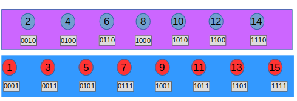
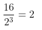

### Binary Indexed Tree (also known as Fenwick tree).


#### Summary

The algorithm implemented here became known by Dr. Peter Fenwick in his
1994 paper.

Solves the problem with frequent updates in a stored in large array
when they must be propagated through the remaining part of 
collection when a change occurs in one of its values.

The typical application of this algorithm that is used as a starting point
applies to a  list of integers that need to provide the sum of all of its
data points up to a specific index but the same approach can be used for
any other operation (for example multiplication or subtraction).

A trivial solution where we will keep the sum in a list suffers from poor
performance when a value is changed since the same change must be applied
to all of the remaining values resulting to an `O(n)` complexity for every
update. 

This algorithm holds some pre-calculated sums to allow for much quicker 
operations that can be completed in `O(log(n))` time complexity; it uses 
some interesting properties of binary arithmetic that will become obvious 
from the solution given in this repository.    

See also:

[wikipedia](https://en.wikipedia.org/wiki/Fenwick_tree)

[Fenwick paper](static/fenwick-paper.pdf)

#### An example of a brutal solution

Let's consider the following array of integers:

```python
values = [2, 8, 3, 6, 1, 2, 5, 1, 9, 7, 2, 8, 8, 5, 1]
```

Using this array we can construct another array holding the sums up to 
every index on it as can be seen here:


To keep the sums up to date when we increase the value for a specific index
we need to propagate it until the end of the array as can be seen in the 
following picture where increasing the value at index 9 by 2 requires 7 more
additions for the remaining indexes:
 

 
Which results to the following updated array:


Obviously this solution has an `O(n)` complexity for each update operation 
and a `O(1)` for a retrieval. If the array size can become very large and 
we expect to have a lot of updates it is easy to realize that we need a 
faster algorithm to keep out solution responsive.

#### Visualization of the solution

Assume a array of 15 items; for now we will not consider the contents of 
it but we will focus only on the indexes. Also to keep things easier to
understand we will consider the array as 1-based (we can always add a dummy
0 based index to keep things consistent with the programming language of
choice as most of them use this numbering) as it can be seen in the following
picture:


Note that the red indexes are all ending to a `1` bit while all the others 
to a `0`. Using this observation "pushing" the `0` ending indexes one level
up creates the following view:



We observe that all the indexes in the second layer are ending in `0`; this 
happens because all of them are even numbers while those in the first layer 
end with `1` because they are even. If we do the same thing applied to the 
second layer but now instead of keeping those who end in `1` we keep `10` we
result to the following:


Now lets do the same `layer separation` for the remaining indexes:


Let's consider the following graph containing all the numbers from  1 - 15:

### The algorithm

In the picture above we can make an interesting observation: 

> All the indexes in each layer end with the same binary suffix

An index whose suffix is `n` means that the `n-1` indexes can be found simply
be generating all the possible binary combinations of the remaining bits.

For example:

Index 12 which is 1100 in binary will be preceded from the following indexes:

| Decimal | Binary |   
|---------|--------|
|  12     | 1100   |
|  11     | 1011   |
|  10     | 1010   |
|   9     | 1001   |

    
Having said this, the following graph makes now sense as it displays all the
indexes connected to the `n-1` indexes right before it:
    


Using the above graph we can derive the following table:

Node Index   | Linked Nodes
------------ | -------------
1            | {1}
2            | {1,2}
3            | {3}
4            | {1, 2, 3,  4}
5            | {5}
6            | {5, 6}
7            | {7}
8            | {1, 2, 3, 4, 5, 6, 7, 8}
9            | {9}
10           | {9, 10}
11           | {11}
12           | {9, 10, 11, 12}
13           | {13}
14           | {13, 14}
15           | {15}

 
### Implementation 

#### Least Significant bit

Given a positive integer i we call its `least significant bit` the first bit from 
its end having the value 1 as it can be seen in the following image that
displays in red the least significant bits for the decimal numbers 13, 12, 8:


To find the least significant bit for a number x we can use the following 
code:

```python
d = x & -x
```

and to find the next smaller number with the least significant bit flipped we
can use the following code: 

```python
x = x - (x & -x)
```

using this approach the following function returns a list of all of its flipped
components:

```python
def breakdown_by_least_significant_bit(x):
    values = []
    while x:
        values.append(x)
        x = x - (x & -x)
    return values
 ```

For example running the following code:


```python
for x in breakdown_by_least_significant_bit(13):
    print(x, bin(x))
```

we are getting this output:
```
13 0b1101
12 0b1100
8 0b1000
```

#### The logic to update the value of an index

To update the value of a specific element in the index we use its value and 
the

```python
def build_index(values):
    """Builds the Binary Indexed Tree for the sums of values.
    
    :param list values: A list of values that will be used to calculate their
    sums by index.
    
    :returns: A list of pre-calculated data that will be used for the sum
    calculations.

    :type: list.
    """
    index = [0]
    for i in range(0, len(values)):
        total = 0
        j = i + 1
        for y in range(0, j & -j):
            total += values[i - y]
        index.append(total)
    return index

def get_sum(index, position):
    """Gets the sum of the elements from 0 to (inclusive) position.

    :param list index: A list of integer containing the pre-calculated sums.

    :param int position: The 0 based index of the element to calculate the
    (inclusive) sum up to.

    :return: The sum of the elements from 0 to (inclusive) position.
    :rtype: int.
    """
    total = 0
    while position:
        total += index[position]
        position = position - (position & -position)
    return total

def increase(index, position, value):
    """Increases the value of index in a specific position.
    
    :param list index: A list of integer containing the pre-calculated sums.

    :param int position: The 0 based index of the element to increase its value.
    
    :param int value : The value to increase by.
    """
    while position and position < len(index):
        index[position] += value
        position = position + (position & -position)
```
  
To validate our code we can use the data we have already seen above:


Running the following code:

```python
values = [2, 8, 3, 6, 1, 2, 5, 1, 9, 7, 2, 8, 8, 5, 1]
index = build_index(values)
for i in range(1, len(values)+1):
    print(f'{i:5}: ', get_sum(index, i))
```

produces this output:

```
    1:  2
    2:  10
    3:  13
    4:  19
    5:  20
    6:  22
    7:  27
    8:  28
    9:  37
   10:  44
   11:  46
   12:  54
   13:  62
   14:  67
   15:  68
```

which validates the sum algorithm.

Also following again the example above we can add the value `2` to element
`9` calling the `increase` method and expect the following output:


as can see if we execute this code:

```python
increase(index, 9, 2)
for i in range(1, len(values)+1):
    print(f'{i:5}: ', get_sum(index, i))
```

whose output looks like this:
```
 1:  2
    2:  10
    3:  13
    4:  19
    5:  20
    6:  22
    7:  27
    8:  28
    9:  39
   10:  46
   11:  48
   12:  56
   13:  64
   14:  69
   15:  70
```
 
 ##### Space complexity
 
 To create the `binary indexed tree` we should allocate enough memory to 
 hold all the indexes (the same size with the array to index) and follow
 the same approach we followed above for the creation of the dependency 
 graph.  Given an array of `n` items the amount of the additional memory 
 needed for the index will also be `n` thus its **space complexity** will 
 be `O(n)`.
 
 ##### Index creation
 
 We can see the creation of the index as 'breaking' down the data array to
 `log(n)` layers and for each each element to perform 
 
 Given an array of 16 elements the tree layers will be:
 
| Layer | Element count|Connected count|Operations needed|   
|-------|--------|---------|-----|
|  1    | | 1| 8
|  2    | | 2| 8
|  3    | | 4| 8 
|  4    | | 8| 8

So the total number of necessary operators will be

 

thus the complexity of index creation is:

   
   
##### Retrieving an item

To retrieve an item we need to perform several operations based on its binary
representation. 

Example

For index 10 which is represented in binary as 1010 we need to access the 
following indexes:

1010 (10 in decimal) and 1000 (8 in decimal)

For index 8 which is represented in binary as 1000 we only need to access the
1000 (8) element.

For index 15 which is represented in binary as 1111 we only need to access the
1111 1110 1100 1000 indexes which is the worst case scenario that can be found
in a 16 element index, so this retrieval complexity is:


##### Modifying an item
Changing the value of an element in the index is very similar to retrieving it
but in this case we are going in the opposite direction as we are updating the
depended values thus the complexity in this case will be the same as retrieval:


_______

To keep things easy to follow the following table might be helpful:

| Decimal | Binary |   | Decimal | Binary |
|---------|--------|---|---------|--------|
| 1       | 0001 |   | 8       | 1000 |
| 2       | 0010 |   | 9       | 1001 |
| 3       | 0011 |   | 10      | 1010 |
| 4       | 0100 |   | 11      | 1011 |
| 5       | 0101 |   | 12      | 1100 |
| 6       | 0110 |   | 13      | 1101 |
| 7       | 0111 |   | 14      | 1110 |
|         |      |   | 15      | 1111 |


[]: https://en.wikipedia.org/wiki/Fenwick_tree
