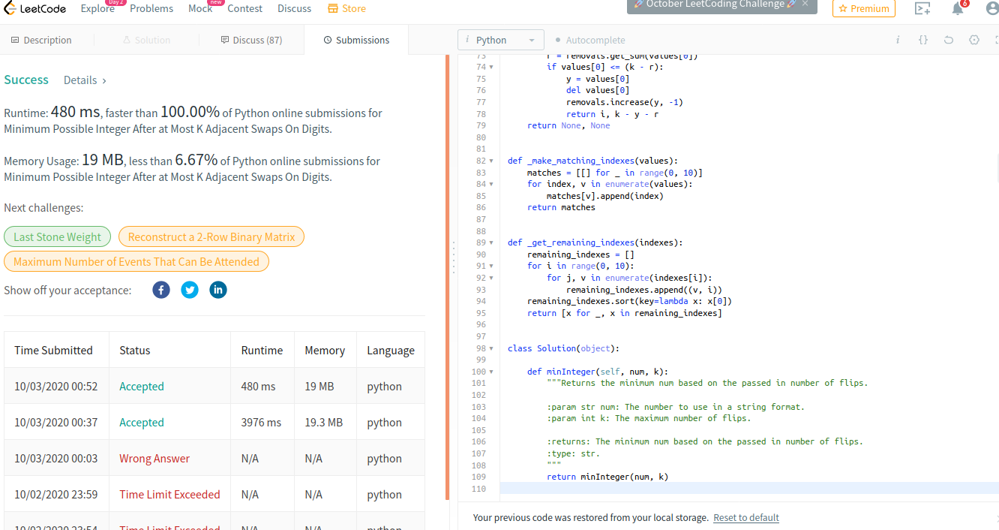

Solves the following leetcode problem.

1505. Minimum Possible Integer After at Most K Adjacent Swaps On Digits

https://leetcode.com/problems/minimum-possible-integer-after-at-most-k-adjacent-swaps-on-digits/

