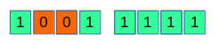
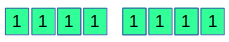
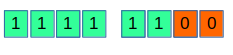
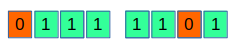
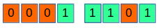
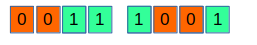
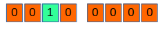
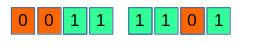

#### Summary

_Write the function `setbits(x, p, n, y)` that returns x with the n
bits that begin at position p set to the rightmost n bits of y,
leaving the other bits unchanged._

This is an important exercise as it involves some interesting 
bitwise manipulations that at first glance seem difficult to 
comprehend. 

To make following the solution easier in this document you can 
find some hints that will explain what is going on.

Let's break the problem to simpler tasks that we then we will
put together in the final solution.

### `mask(p, n)`

Write a function `mask(p, n)` returning a number having all of 
its bits set to 1 expect the n bits starting in position p.

For example lets assume that number is an 8-bit integer, n is 2 and
p is 6; having this input the `mask` function must return the following
integer:

or if we express it in decimal, it must return: `159`

(note that bits are indexed from right to left starting with 0).

The algorithm for this function goes as follows:

I. We can start with a number having all of its digits set as can
be seen here:

II. Change the 2 last digits to 0:

III. Shift the whole number by `p - n + 1` = `5` bits to the left:

### `clear_bits(x, p, n)`

Write a function `clear_bits(x, p, n)`  returning a number having 
the n bits of x starting in p to 0.

For example lets assume the following number expressed an 8-bit 
integer (`125`):

The return value must be:

 (`29`)
 

### `isolate_bits(y, p, n)`

Write a function `isolate_bits(y, p, n)` to keep only the n-bits
set starting from p.

For example assuming `y=57, p=6, n=2` y is represented as:

 (`57`)

The return value must be:

 (`32`)

### `setbits(x, p, n, y)`
We can now implement the `setbits` function using the 
`isolate_bits(y, p, n)` and `clear_bits(x, p, n)` as can be
seen in the following example:

Let's assume:

`x = 125
y = 57
p = 6
n = 2`  

calling `clear_bits(125, 6 ,2)` gives us:

 (`29`)

calling `isolate_bits(57, 6, 2)` gives us:

 (`32`)

Combining the last two using the `|` operator gives us:

 (`61`)

which is the answer we were looking for.