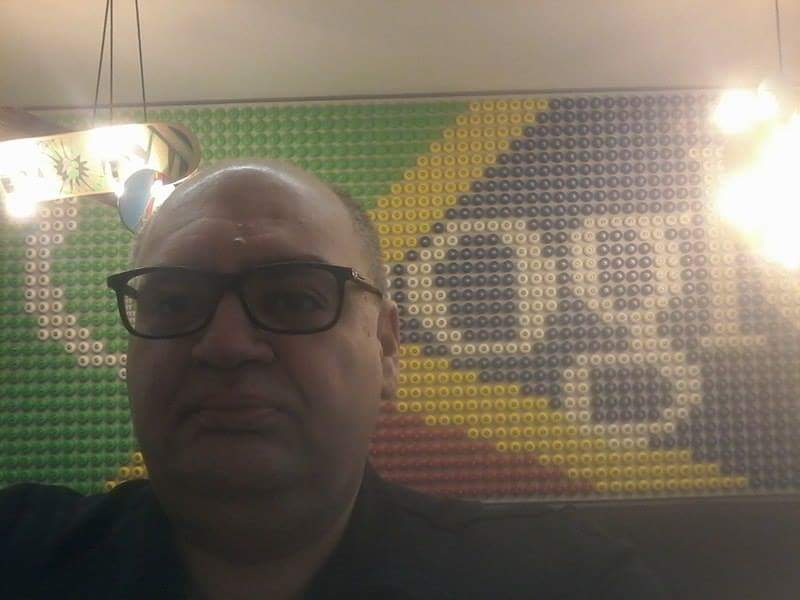
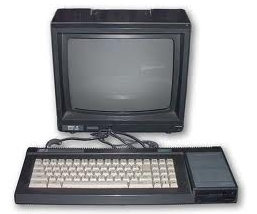
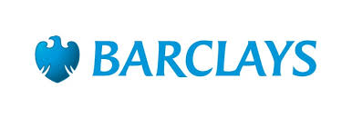
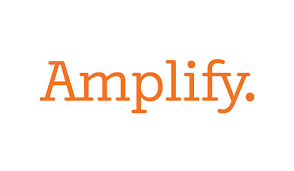
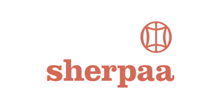
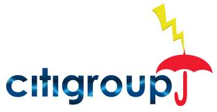
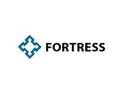
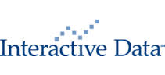

### About
My name is John Pazarzis and I am as a software developer specializing
in back end development of Web applications, artificial intelligence ,
data mining and real time applications. In this blog I am writing
about my views and thoughts as they were formed from my experience and
research about software development.

### What is stored here

I have a directory where I store posts I've written over the years.
They may not reflect my current views, but I keep them for historical
purposes without much editing, just as I originally posted them. It's
a way for me to look back at my past thoughts and experiences, without
changing them to match my present perspective.

### A few words about my experience as a Software Developer
  

I have worked for many companies, ranging
from very large institutional banks and hedge funds and software
companies (google is one of them) to very small startups.  During the
years, I have used many programming languages and technologies. For
more than a decade I have been a C++ enthusiast and gradually I made
the shift to .NET and C# which I kept using from version 1.0 to 4.0
while for the last five years I am focusing almost exclusively in open
source platforms, like linux, python, mongodb, git, mysql, rabbitmq,
Jenkins and vagrant just to name a few.

Without a doubt I am an open source enthusiast and I really believe in
the superiority of open source software and the supporting communities
and related culture and development philosophy.

I have been a programmer since the beginning of time.. My first
contact with computer programming was as a freshman in the
Mathematical School of Crete using Apple II and Pascal, I also have
used punching cards for a few programs that I wrote a few years later,
for the prehistoric CDC Cyber mainframe of the Polytechnic School of
Athens!

Very soon I bought my first home computer and found out that the
meaning of life was hidden in learning how to program it using CP/M,
Z-80 assembly and Turbo Pascal!  When I replaced my Amstrad 6128 with
a PC running at the astonishing speed of 4.77 MHz with two floppy
disks, I thought that I would barely need any other computer upgrade
for the rest of my life. In the same way, it was difficult for me to
believe that I would need to learn much more than the extra powerful
new version of pascal released by borland in the mid 80s called turbo
pascal… The truth, though, is that things did not really work exactly
that way….

Following the evolution of the industry very closely, I had to expand
my software arsenal a little bit beyond the good old classical Turbo
Pascal and Z-80 assembly code: C, C++, MFC, COM, DCOM, Active X, TSQL,
PLSQL was the natural path I followed until early in the beginning of
the millennium, when the next big thing was C# and .NET which had been
the core of my skill for almost a decade. During this period, I worked
a lot on my Design Patterns skills, got an in depth understanding of
relation databases as I had to work with SYBASE, SQLServer and Oracle
(some times simultaneously) and mastered the desktop GUI development.

During this period, I have implemented some interesting applications,
including a 4GL language that was used by stock traders to describe a
trading strategy and optimize it automatically using pattern
recognition algorithms and many more applications mostly related to
the financial sector.

<strong>Some of the Companies that I have worked for</strong>
<table style="border: none;">
<tbody>
<tr style="border: none;">
<td style="border: none;"></td>
<td style="border: none;"></td>
<td style="border: none;"></td>
</tr>
<tr style="border: none;">
<td style="border: none;"></td>
<td style="border: none;"></td>
<td style="border: none;"></td>
</tr>
<tr style="border: none;">
<td style="border: none;"></td>
<td style="border: none;"></td>
<td style="border: none;"></td>
</tr>
</tbody>
</table>
