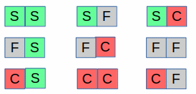
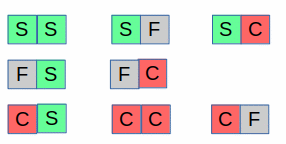
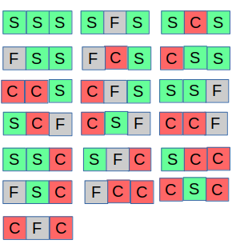
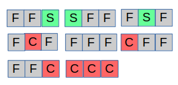
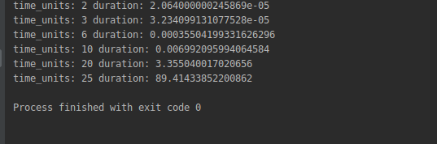
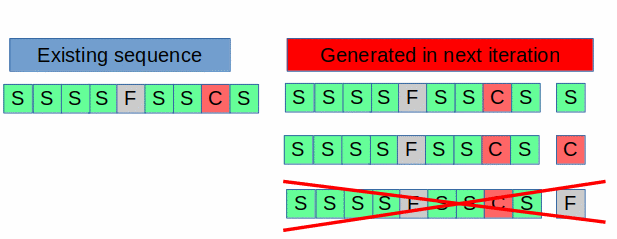
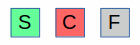
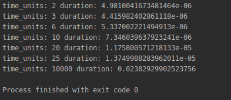

Thinking about Algorithmic problems II
July 3, 2020

<h2>The problem</h2>
Lets assume that we have an electronic device that in one unit of time can send a request and receive a response from a server; the possible responses are as follows:
<ul>
	<li>S: Success</li>
	<li>C: Corrupted data</li>
	<li>F: Failure to connect</li>
</ul>
Assuming 2 units of time the sequence our possible responses are as follows:

The software that controls our device will automatically stop in any one of the  following conditions:
<ul>
	<li>Received two Failures at any time</li>
	<li>Received three consecutive corrupted data</li>
</ul>
Based on this definition the sequence for 2 units of time the possible valid signals are 8 :

(Note that the FF sequence has been dropped)

To make our requirement cleaner assuming 3 units of time the sequence of valid signals (19) will be the following:

Note that the following 8 signals are dropped:

&nbsp;

Our problem is the following:

<em><strong>For a given number of units of time calculate the count of all possible valid sequences of signals</strong></em>
<h2>The Brutal Solution</h2>
At this point you should pause and re-read the definition of the problem and try to digest it.

We already have the following test data:
<table>
<tbody>
<tr>
<th>Units of time</th>
<th>Number of sequences</th>
</tr>
<tr>
<td style="text-align: center;">1</td>
<td style="text-align: center;">3</td>
</tr>
<tr>
<td style="text-align: center;">2</td>
<td style="text-align: center;">8</td>
</tr>
<tr>
<td style="text-align: center;">3</td>
<td style="text-align: center;">19</td>
</tr>
</tbody>
</table>
Simply be noticing that each new sequence multiplies the existing signals by a factor of 3 for each Success, Failure and Corrupted message received we can easily code a brutal force solution which for each new time unit creates the new sequences and drops those ending with three corruptions or containing two failures at any point. Using our test data our brutal solution looks like the following:

[python]
def count_sequences_brutal(units_of_time):
    sequences = ['S', 'F', 'C']
    for i in range(1, units_of_time):
        new_sequences = []
        for sequence in sequences:
            for c in 'SFC':
                new_str = sequence + c
                if 'CCC' in new_str or new_str.count('F') >= 2:
                    continue
                new_sequences.append(new_str)
        sequences = new_sequences
    return len(sequences)

assert count_sequences_brutal(1) == 3
assert count_sequences_brutal(2) == 8
assert count_sequences_brutal(3) == 19
[/python]

Now that we have a correct solution in place lets try to see how efficient it is in terms of performance as the number of time units is increasing:

Running the following code:

[python]
import timeit
import functools

for time_units in [2, 3, 6, 10, 20, 25]:
    print(
        'time_units:', time_units, 'duration:',
        timeit.timeit(stmt=functools.partial(count_sequences_brutal, time_units), number=1)
    )
[/python]

We are getting the following output:

Note how quickly the running time grows; for 10 unit times 0.006 seconds are required but for 25 we are reaching more than 89 seconds!

Obviously our brutal force algorithm is terrible in terms in performance as it big O complexity is exponential. It still can be helpful for us since we create the following testing data that we will use later to test our efficient algorithm:
<table>
<tbody>
<tr>
<th>Units of time</th>
<th>Number of sequences</th>
</tr>
<tr>
<td style="text-align: center;">1</td>
<td style="text-align: center;">3</td>
</tr>
<tr>
<td style="text-align: center;">2</td>
<td style="text-align: center;">8</td>
</tr>
<tr>
<td style="text-align: center;">3</td>
<td style="text-align: center;">19</td>
</tr>
<tr>
<td style="text-align: center;">4</td>
<td style="text-align: center;">43</td>
</tr>
<tr>
<td style="text-align: center;">5</td>
<td style="text-align: center;">94</td>
</tr>
<tr>
<td style="text-align: center;">6</td>
<td style="text-align: center;">200</td>
</tr>
<tr>
<td style="text-align: center;">7</td>
<td style="text-align: center;">418</td>
</tr>
<tr>
<td style="text-align: center;">8</td>
<td style="text-align: center;">861</td>
</tr>
<tr>
<td style="text-align: center;">9</td>
<td style="text-align: center;">1753</td>
</tr>
<tr>
<td style="text-align: center;">10</td>
<td style="text-align: center;">3536</td>
</tr>
</tbody>
</table>
<h2>Analyzing the problem</h2>
At this point we have enough data and understanding of our problem so we can analyze it further and try to discover some hidden tricks that might allow us to come up with a smart algorithm that will solve it efficiently.

Thinking about our problem we can see that all of the following statements are all correct about a valid sequence:
<ul>
	<li>Ends with one of the letters <strong>S</strong> <strong>F</strong> <strong>C</strong> or <strong>CC</strong></li>
	<li>Contains none or a single failure <strong>F</strong></li>
	<li>Does not contain a <strong>CCC</strong> sub-sequence</li>
</ul>
Each iteration goes through all of the previous sequences and for each of them creates three new sequences appending the <strong>S</strong> <strong>F</strong> <strong>C</strong> to its end; as this happens some of them will be rejected as invalid due to the rules we have defined above as can be seen in this picture:

Having said this, we can express the count of valid sequences at any point by adding up the following counters:
<table>
<tbody>
<tr>
<th>Counter Name</th>
<th>Description</th>
</tr>
<tr>
<td style="text-align: center;"><strong>FS</strong></td>
<td style="text-align: center;">exactly one <strong>F</strong>, ending with <strong>S</strong></td>
</tr>
<tr>
<td style="text-align: center;"><strong>FC</strong></td>
<td style="text-align: center;">exactly one <strong>F</strong>, ending with <strong>C</strong></td>
</tr>
<tr>
<td style="text-align: center;"><strong>FCC</strong></td>
<td style="text-align: center;">exactly one <strong>F</strong>, ending with <strong>CC</strong></td>
</tr>
<tr>
<td style="text-align: center;"><strong>S</strong></td>
<td style="text-align: center;">no <strong>F</strong>, ending with <strong>S</strong></td>
</tr>
<tr>
<td style="text-align: center;"><strong>C</strong></td>
<td style="text-align: center;">no <strong>F</strong>, ending with <strong>C</strong></td>
</tr>
<tr>
<td style="text-align: center;"><strong>CC</strong></td>
<td style="text-align: center;">no <strong>F</strong>, ending with <strong>CC</strong></td>
</tr>
<tr>
<td style="text-align: center;"><strong>F</strong></td>
<td style="text-align: center;">ending with <strong>F</strong></td>
</tr>
</tbody>
</table>
If we could calculate these counters for each iteration using their previous value our solution could have become very fast as only one pass would be sufficient to solve the problem and this exactly what we will try to do next.
<h2>The algorithmic solution</h2>
After the first time unit our sequences look as follows:

with the following counters:
<table>
<tbody>
<tr>
<th>Counter Name</th>
<th>Count&gt;</th>
</tr>
<tr>
<td style="text-align: center;"><strong>FS</strong></td>
<td style="text-align: center;">0</td>
</tr>
<tr>
<td style="text-align: center;"><strong>FC</strong></td>
<td style="text-align: center;">0</td>
</tr>
<tr>
<td style="text-align: center;"><strong>FCC</strong></td>
<td style="text-align: center;">0</td>
</tr>
<tr>
<td style="text-align: center;"><strong>S</strong></td>
<td style="text-align: center;">1</td>
</tr>
<tr>
<td style="text-align: center;"><strong>C</strong></td>
<td style="text-align: center;">1</td>
</tr>
<tr>
<td style="text-align: center;"><strong>CC</strong></td>
<td style="text-align: center;">0</td>
</tr>
<tr>
<td style="text-align: center;"><strong>F</strong></td>
<td style="text-align: center;">1</td>
</tr>
</tbody>
</table>
Adding all counters we get 3 which matches the valid signals we have so far.

The second time unit will append each or the S F C to each of the existing sequences, creating 9 possible combinations.

Since we already have broken down the existing sequences based on the rules of the problem, instead of creating all the combinations we can now use the known information to increase all the available counters for each of the S F C.

The next received message will do the following:

<strong>Processing the S (success) case</strong>
The <strong>FS</strong> counter (has one Failure, ends with Success) becomes the total of the previous: FS, FC, FCC and F
The <strong>S</strong> counter (has no Failure, ends with Success) becomes the total of the previous: S, C, CC

<strong>Processing the C (corrupted message) case</strong>

The <strong>FC</strong> counter (has one Failure, ends with C) becomes the total of the previous: FS and F
The <strong>C</strong> counter (has no Failure, ends with C) becomes the previous: S
The <strong>FCC</strong> counter (has no Failure, ends with C) becomes the previous: FC
The <strong>CC</strong> counter (has no Failure, ends with C) becomes the previous: C

<strong>Processing the F (failure message) case</strong>
The <strong>F</strong> counter (ending with Failure) will become the previous: C, S, CC

an easier to visualize view of what is said above is the following:
<table style="font-weight: bold;">
<tbody>
<tr>
<th>Counters sequence with length N</th>
<th>Calculated based on previous sequence</th>
</tr>
<tr>
<td style="text-align: center;"><strong>FS [n] </strong></td>
<td style="text-align: center;"><strong>FS [n-1] + FC [n-1] + FCC [n-1] + F [n-1] </strong></td>
</tr>
<tr>
<td style="text-align: center;">FC [n]</td>
<td style="text-align: center;">FS [n-1] + F [n-1]</td>
</tr>
<tr>
<td style="text-align: center;">FCC [n]</td>
<td style="text-align: center;">FC [n-1]</td>
</tr>
<tr>
<td style="text-align: center;">S [n]</td>
<td style="text-align: center;">S [n-1] + C [n-1] + CC [n-1]</td>
</tr>
<tr>
<td style="text-align: center;">C [n]</td>
<td style="text-align: center;">S [n-1]</td>
</tr>
<tr>
<td style="text-align: center;">CC [n]</td>
<td style="text-align: center;">C [n-1]</td>
</tr>
<tr>
<td style="text-align: center;">F [n]</td>
<td style="text-align: center;">C [n-1] + S [n-1] + CC [n-1]</td>
</tr>
</tbody>
</table>
Manually applying these calculations for several iterations we are getting the following results:
<table>
<thead>
<tr>
<th title="Field #1">Counter</th>
<th title="Field #2">1</th>
<th title="Field #3">2</th>
<th title="Field #4">3</th>
<th title="Field #5">4</th>
<th title="Field #6">5</th>
<th title="Field #7">6</th>
<th title="Field #8">7</th>
<th title="Field #9">8</th>
<th title="Field #10">9</th>
<th title="Field #11">10</th>
</tr>
</thead>
<tbody>
<tr>
<td><strong>FS</strong></td>
<td align="right">0</td>
<td align="right">1</td>
<td align="right">4</td>
<td align="right">12</td>
<td align="right">30</td>
<td align="right">70</td>
<td align="right">156</td>
<td align="right">337</td>
<td align="right">712</td>
<td align="right">1479</td>
</tr>
<tr>
<td><strong>FC</strong></td>
<td align="right">0</td>
<td align="right">1</td>
<td align="right">3</td>
<td align="right">8</td>
<td align="right">19</td>
<td align="right">43</td>
<td align="right">94</td>
<td align="right">200</td>
<td align="right">418</td>
<td align="right">861</td>
</tr>
<tr>
<td><strong>FCC</strong></td>
<td align="right">0</td>
<td align="right">0</td>
<td align="right">1</td>
<td align="right">3</td>
<td align="right">8</td>
<td align="right">19</td>
<td align="right">43</td>
<td align="right">94</td>
<td align="right">200</td>
<td align="right">418</td>
</tr>
<tr>
<td><strong>S</strong></td>
<td align="right">1</td>
<td align="right">2</td>
<td align="right">4</td>
<td align="right">7</td>
<td align="right">13</td>
<td align="right">24</td>
<td align="right">44</td>
<td align="right">81</td>
<td align="right">149</td>
<td align="right">274</td>
</tr>
<tr>
<td><strong>C</strong></td>
<td align="right">1</td>
<td align="right">1</td>
<td align="right">2</td>
<td align="right">4</td>
<td align="right">7</td>
<td align="right">13</td>
<td align="right">24</td>
<td align="right">44</td>
<td align="right">81</td>
<td align="right">149</td>
</tr>
<tr>
<td><strong>CC</strong></td>
<td align="right">0</td>
<td align="right">1</td>
<td align="right">1</td>
<td align="right">2</td>
<td align="right">4</td>
<td align="right">7</td>
<td align="right">13</td>
<td align="right">24</td>
<td align="right">44</td>
<td align="right">81</td>
</tr>
<tr>
<td><strong>F</strong></td>
<td align="right">1</td>
<td align="right">2</td>
<td align="right">4</td>
<td align="right">7</td>
<td align="right">13</td>
<td align="right">24</td>
<td align="right">44</td>
<td align="right">81</td>
<td align="right">149</td>
<td align="right">274</td>
</tr>
<tr>
<td><strong>Totals</strong></td>
<td align="right"><strong>3</strong></td>
<td align="right"><strong>8</strong></td>
<td align="right"><strong>19</strong></td>
<td align="right"><strong>43</strong></td>
<td align="right"><strong>94</strong></td>
<td align="right"><strong>200</strong></td>
<td align="right"><strong>418</strong></td>
<td align="right"><strong>861</strong></td>
<td align="right"><strong>1753</strong></td>
<td align="right"><strong>3536</strong></td>
</tr>
</tbody>
</table>
Note that the bottom line of the above table contains the totals for each iteration; comparing them with we have gotten from the brutal solution we happily see that the results are matching so our algorithm is correct.
<h2>The code</h2>
Now that we have figured out the algorithm the next (and easiest) step is to to express it in code as can be seen here:

[python]
def count_sequences(N):
    fs = 0
    fc = 0
    fcc = 0
    s = 1
    c = 1
    cc = 0
    f = 1

    n = 1
    while n < N:
        fs, fc, fcc, s, c, cc, f = (
            fs + fc + fcc + f,
            fs + f,
            fc,
            s + c + cc,
            s,
            c,
            c + s + cc
        )
        n += 1

    return fs + fc + fcc + s + c + cc + f
[/python]

We can also use the brutal solution to validate our implementation:

[python]
for i in range(1, 10):
    assert count_sequences(i) == count_sequences_brutal(i)
[/python]

Running the performance test as we did with the brutal solution previously:

[python]
for time_units in [2, 3, 6, 10, 20, 25, 10000]:
    print(
        'time_units:', time_units, 'duration:',
        timeit.timeit(stmt=functools.partial(count_sequences, time_units), number=1)
    )
[/python]

gives us the following results:

Comparing this output with what we have gotten before proves that now we have an extremely much faster algorithm that can be used for a very large number of iteration without significant delays.

To be more precise the time complexity of our algorithm is linear (O(n)) while its space complexity is O(1) as we do not allocate any additional memory to run it.
<h2>Conclusion</h2>
In this posting we had to deal with a problem whose obvious solution was very time consuming but after thinking a bit and understanding it better we were able to discover a "smart" trick to solve it efficiently; the same approach is applicable to many similar problems where the best solution lies in discovering some "hidden" properties that are not apparent from the first glance.