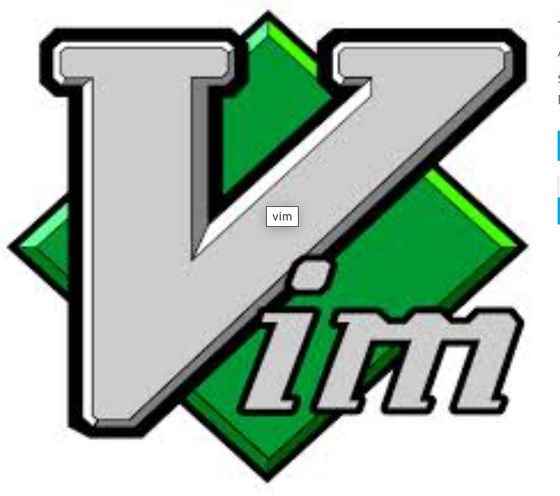

# The best programmer’s editor

May 13, 2014

As a professional programmer, I spend thousands of hours in front of a computer
screen every year and without a doubt the two tools I use the most are the
operating system command prompt and my editor of choice. Here I will talk about
the later, which happens to be the super editor going by the name of vim!

During the years, I have tried quite a few editors and IDEs, like Visual
Studio, eclipse, net beans, notepad+, turbo pascal and of course emacs (and
yes, I also have written elisp extentions to it)! I have always been trying to
find the best way to edit my code with ultimate speed and efficiency and this
is why I have used so many different editors but I have to admit that I was
never able to find anything better than vim.

Yes, there definitely is a learning curve associated with it and I would even
go as far as to claim that vim grows with you, as there is always something new
to be discovered no matter how good you know it. Besides that though, anyone
can improve his productivity after a couple of weeks of initial contact with
vim, that will be enough to surpass the capabilities of any other editor (with
the exception of emacs who also is very powerful as well).

I am a firm believer that the increased easiness of use that is so much praised
by users of IDEs, is nothing else than an illusion. Vim has way more
capabilities from any other IDE while is extremely faster, fully customizable
and available to any operating system.

Regardless of the level of your expertize as a programmer, I strongly encourage
you, to at least try vim for a few weeks, going through its build in tutorial
and reading its free book.. Maybe you will change your opinion about your
favorite editor and become a vim devotee!

Here you can download vim:
http://www.vim.org/

and here you can find the free vim book:

ftp://ftp.vim.org/pub/vim/doc/book/vimbook-OPL.pdf
