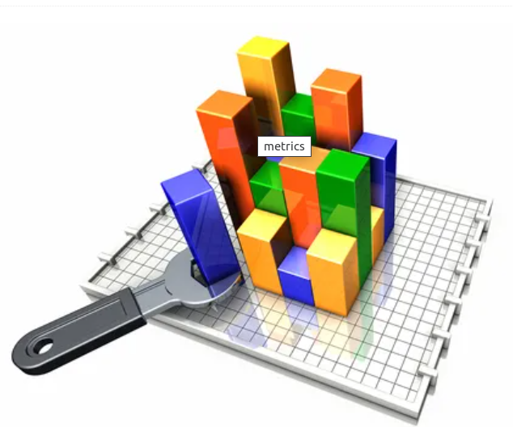

# Metrics converted to goals lose their focus
October 7, 2015

One of the common discussions I have had with my colleagues over the last years
was about the creation of metrics to express the productivity and the quality
of an individual developer. At first glance, the idea of expressing the ability
of a programmer, with a small set of easy to digest figures, seems both
attractive and feasible. After all, this approach appears to work nicely in
sectors like the stock market, weather forecasting or customer satisfaction, so
it is very logical to assume that we can accomplish something similar when it
comes to software developers.

Yet, I am reluctant to believe that it is possible to create an effective
metric to measure the quality and effectiveness of a computer programmer.
Although something similar, might be feasible for other kind of activities,
mostly those involving very tangible production based on some kind of a
repetitive routine, writing software presents a completely different paradigm,
which is extremely difficult to quantify.

Think for example of what kind of metric would have even be capable of
comparing a poetry masterpiece, consisting of just a few words to a New York
City telephone book!  Software development resembles more to a poem rather than
a pedestrian document such as telephone book, which simply gathers similar
information and presents it in a purely mechanical format.

As a developer, I tend to view code as the means to express a model for a
tangible problem to be solved. Given this definition, the ultimate “metric” to
measure a solution, has to be related to how well it approaches the real world,
its ability to function for long periods of time without interruptions and
finally its adaptability to future needs, that will allow it to evolve as time
goes by.

Another serious problem I can see when it comes to programmers’ performance
metrics, lies in the fact that once the latter are introduced to a team, each
individual tends to adopt to them, essentially shifting his focus from
developing quality software to an effort to maximize his metrics, since they
will represent the most comprehensible way for his management to evaluate his
performance.

In other words, metrics will eventually be converted to goals causing the team
to lose its focus, which of course is the delivery of a working solution and
not the maximization of some arbitrary metric.

I think that the best way to measure the abilities of a developer depends on
how well his application can cover the needs of its users, given the cost and
time constraints that had to be met while creating the solution. Successful
developers should build systems that outlive their expectations; they should
have the ability to easily adapt to future needs with minimal effort and at the
same time allow for easy maintenance and bug fixing during the entire lifespan
of the project.
