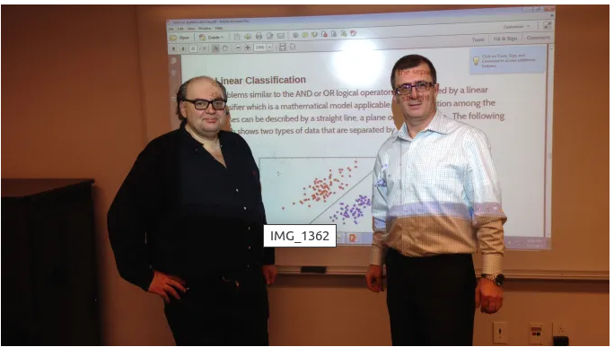
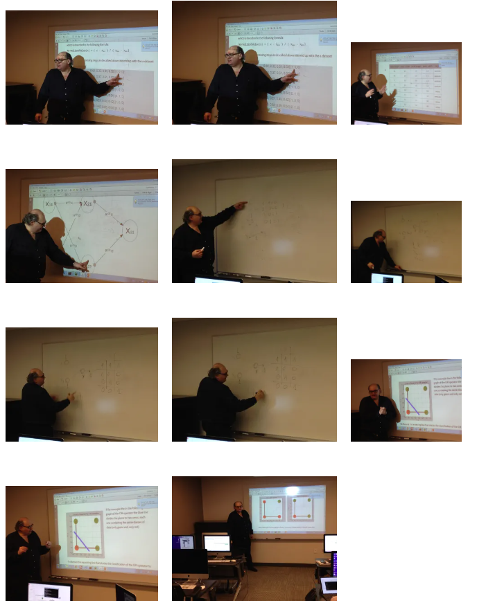

# Python And Neural Networks NYU Lecture
April 8, 2017

Last week I presented a lecture as part of the Business Intelligence Analytics
and Data Science course in the School of Professional Studies of NYU here in
New York that is taught from Stavros Zervoudakis.

The objective of the lecture was to introduce students to python and provide
them with a first glance in the theory neural networks and also some hands-on
examples of its use based on code that I wrote specifically for the class.

If interested you can download the code from my git repository and let me know
if you have any related questions or comments.

