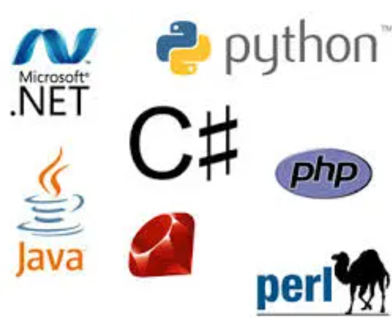

# Programming Languages
March 11, 2013

As a seasoned programmer for the last three decades I have used a wide spectrum
of programming languages and development approaches.

By the end of the 80’s I was introduced to the concepts of Object Oriented
Programming using as main language the C++ which I still follow very closely.

As a heavy user of Visual C++, MFC and COM my transition to the .NET platform
was quite natural becoming an early adaptor of C# since its very early
releases. I have used pretty much all of the core technologies that consist the
.NET framework and the Microsoft stack in general like ASP.NET, WCF, WPF, Win
Forms , LINQ and SQLServer.

I have always been very keen about the free and open source software having
invested a lot on Linux, MySQL and Python…

Domain Specific Languages is a concept that I have applied several times in the
past and still feel very keen about the potential of this approach.

Functional programming is another approach looking rather attractive and after
a long period of obscurity it has been gaining a lot of momentum lately.

I maintain a long time interest in this type of programming, materializing it
using Scheme and Lisp in the past and currently by F#, which we believe has a
great potential as it combines both worlds of Functional programming and .NET.
