# Buying and Selling stocks with maximum profit
July 6, 2020

<h2>Summary</h2>
This posting continues the discussion about algorithmic thinking solving a well know problem that is known as <strong> Best Time to Buy and Sell Stock</strong> with maximum profit.

The solution to this problem is hard and I do not believe that it makes a good interview question but it is still a good exercise that might take an intermediate developer a few hours to solve.

To gain the maximum value you should allocate enough time to try to solve it in an efficient way before you read the solution.
<h2>The problem</h2>
We are given a list of integers representing stock prices; we must find the maximum profit that can be made assuming at most two no overlapping BUY - SELL transactions.

For example assuming the following list of prices:

[7, 3, 13, 13, 6, 19, 10, 8, 15, 18]

the maximum profit that can be made is <strong>26 </strong>which is made as follows:

Buy at 3 - Sell at 19, Buy at 8 - Sell at 18

as can be seen in this picture:
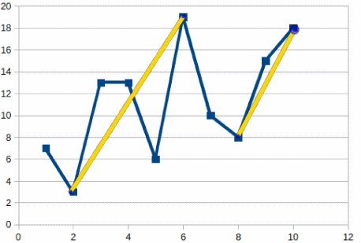

<h2>Initial thoughts</h2>
From the first glance, the problem looks simple; as we will see shortly it is not!

Thinking about the problem we can see that there exist three "types" of solutions:
<ul>
	<li>No pair of Buy - Sell that shows profit.</li>
	<li>One pair of Buy - Sell that shows the maximum profit.</li>
	<li>Two pairs of Buy - Sell that shows the maximum profit.</li>
</ul>
It is trivial to convert this approach to a function that creates all the pairs by 2 and 4 points and return the maximum profit:

[python]
import itertools

def get_max_profit(prices):
    all_indexes = list(range(len(prices)))

    max_profit = 0
    for i1, i2 in itertools.combinations(all_indexes, 2):

        profit = prices[i2] - prices[i1]

        if profit > max_profit:
            max_profit = profit

    for i1, i2, i3, i4 in itertools.combinations(all_indexes, 4):

        profit = prices[i2] - prices[i1] + prices[i4] - prices[i3]
        if profit > max_profit:
            max_profit = profit

    return max_profit

[/python]

To make performance testing easier lets create a function to return a random price sequence and run the get_max_profit function for different sizes of input:

[python]
import timeit
import functools
import random

def creating_dummy_prices(n):
    """Creates a list or prices to use for stress testing.

    :param int n: The length of the list to create.

    :return: A list of prices.
    :rtype: list.
    """
    return [random.randint(0, 20) for _ in range(n)]

for n in [10, 20, 100, 150, 200]:
    data = creating_dummy_prices(n)
    f = functools.partial(get_max_profit, data)
    print(f'Number of prices: {n}', ' Duration in seconds', timeit.timeit(f, number=1))

[/python]

The code above produces the following output:
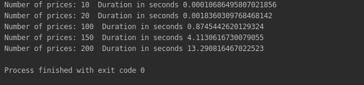

Note that a sequence of 20 points requires a few milliseconds but as we ramp up to 200 we are quickly reaching more than 13 seconds.

This happens because our solution is extremely slow; note that we are calculating all the possible pairs for 2 and 4 points taken from prices meaning that the number of the required profit calculations are given by the following formula:
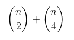

which translates to a quadratic time complexity:
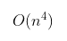

It is clear that we need to a smarter solution that will allow us to solve it in a more efficient way.
<h2>A better performing "brutal solution"</h2>
As we think the problem deeper, we realize that for each data point in the prices curve we have a left - right maximum profit transaction meaning that if we iterate though all the points and store all the totals (counting only positive values) their maximum  will be the desired value.

In this case the complexity of our solution will be proportional to the size of the array multiplied by the cost of finding the larger transaction in the left - right sides of the curve.

To try this approach we need to create a function that will receive a subsection of prices and return the maximum possible profit for it what is important though is that we want to avoid the creation of all possible pairs as we have done before and reduce the finding of the largest profit transaction to a single pass per subsection. After a little thinking we end up with the following solution:

[python]
import timeit
import functools
import random

def creating_dummy_prices(n):
    """Creates a list or prices to use for stress testing.

    :param int n: The length of the list to create.

    :return: A list of prices.
    :rtype: list.
    """
    return [random.randint(0, 20) for _ in range(n)]

def brutal_find_max_delta(a):
    largest_so_far = None
    lower_so_far = None
    m = 0
    for value in a:
        if largest_so_far is None or largest_so_far < value: largest_so_far = value if lower_so_far is None or lower_so_far > value:
            lower_so_far = value
            largest_so_far = 0

        m = max(m, largest_so_far - lower_so_far)
    return m

def brutal_solution(b):
    s = brutal_find_max_delta(b)
    for i in range(2, len(b) - 1):
        x1, x2 = b[0:i], b[i:]
        s = max(s, brutal_find_max_delta(x1) + brutal_find_max_delta(x2))
    return s

for n in [10, 20, 100, 150, 200]:
    data = creating_dummy_prices(n)
    f = functools.partial(brutal_solution, data)
    print(f'Number of prices: {n}', ' Duration in seconds',
          timeit.timeit(f, number=1))

[/python]

Which gives us the following output:

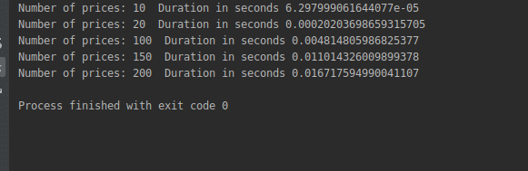

Note that calculating the maximum profit now takes 0.16 which compared to the 13.29 that we have gotten before looks like a great improvement but we still have more work to do.

If we increase the size of the curve and run the following code:

[python]
for n in [1000, 2000, 3000, 5000]:
    data = creating_dummy_prices(n)
    f = functools.partial(brutal_solution, data)
    print(f'Number of prices: {n}', ' Duration in seconds',
          timeit.timeit(f, number=1))
[/python]

we are getting the following timings:

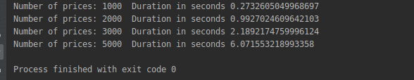

Although much faster than before, the function slows down quickly as the size of the curve grows.

Before we move forward and try to improve our solution it will be helpful to understand our current solution which is based on two basic concepts:
<ul>
	<li>Each data point in the curve divides it to a left - right section</li>
	<li>We can calculate the maximum profit by iterating through all the points and compare their left - right totals</li>
	<li>We need to calculate the maximum profit for each subsection</li>
</ul>
&nbsp;

The algorithm to calculate the maximum profit for a subsection is interesting so lets take a closer look onto it..
<h2>Maximum profit for sequence of prices</h2>
Calculating the transaction with the maximum profit for a sub-sequence is at the heart of our solution and we need to digest it well in order to understand the solution to our problem.

Given the sequence of prices [8, 12, 1, 9, 6, 11] it is easy to conclude that the maximum profit that can be made is 10 (buy on the third point and sell in the tenth) :

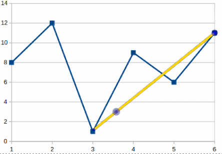

To find out this profit we will need to iterate through the whole curve and at each point "remember" the lowest and highest prices we have seen so far. More than this we need to be sure that the lowest price occurs before the highest; this is what makes this algorithm a bit tricky.

As we move forward (to the right) if we discover a new lowest price we reinitialize our stored lower value to the new one and also set the maximum value to zero otherwise if we have reached a new larger value we are replacing the larger value so far with it.

At this point it is simple to calculate the larger profit for any iteration point if we compare the current profit with the previous, this is exactly what this code is doing:

[python]
def brutal_find_max_delta(a):
    largest_so_far = None
    lower_so_far = None
    m = 0
    for value in a:
        if largest_so_far is None or largest_so_far < value: largest_so_far = value if lower_so_far is None or lower_so_far > value:
            lower_so_far = value
            largest_so_far = 0

        m = max(m, largest_so_far - lower_so_far)
    return m
 [/python]

Since we are iterating through all the prices passed to the function its complexity is O(m) (m is the length of the passed in array).

As said before to calculate the maximum possible profit for zero, one or two transactions we need to iterate through the whole sequence of prices (whose length is n) and for each point call the brutal_find_max_delta function for the left and right side. Note the for each point the complexity will be: O(m) + O(n-m) or O(n).

Based on this the total complexity of the brutal solution will be quadratic:

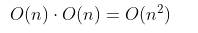

So, although this approach is an improvement when compare to the previous solution, it is still very slow and needs to be improved further.

Tip: Before you continue be sure that you understand the implementation of brutal_find_max_delta.
<h2>Precalculating maximum profits</h2>
In our solution about we note that what is really "expensive" is the calculation of the left - right maximums; this makes us to think if we can simplify their calculations by re-using some of the already calculated data. Our approach will be to create a new list having the same length as the passed in list of prices where each point will have the left-wise maximum profit.

Doing so appears to be quite easy changing the brutal_find_max_delta to keep track of the maximums per point:

[python]
def left_side_max_deltas(prices):
    """Returns a list whose each element has the max delta from left side.

    :param list prices: The list of prices.

    :return: The list with the max delta from left.
    :rtype: list.
    """
    deltas = [0] * len(prices)
    largest_so_far = None
    lower_so_far = None
    m = 0
    for index, value in enumerate(prices):
        if largest_so_far is None or largest_so_far < value: largest_so_far = value if lower_so_far is None or lower_so_far > value:
            lower_so_far = value
            largest_so_far = 0

        m = max(m, largest_so_far - lower_so_far)
        deltas[index] = m

    return deltas

[/python]

Calling this function using the above testing data:

[python]
print(left_side_max_deltas([8, 12, 1, 9, 6, 11]))
[/python]

We are getting the following output:

[0, 4, 4, 8, 8, 10]

as can be seen in this graph:

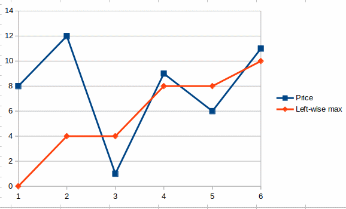

With a simple modification of the left_side_max_deltas we can write a similar function to calculate the maximums from the right side of a point:

[python]
def right_side_max_deltas(prices):
    """Returns a list whose each element has the max delta from right side.

    :param list prices: The list of prices.

    :return: The list with the max delta from right.
    :rtype: list.
    """
    deltas = [0] * len(prices)
    index = len(prices) - 1

    largest_so_far = None
    lower_so_far = None
    m = 0

    while index >= 0:
        value = prices[index]

        if largest_so_far is None or largest_so_far < value: largest_so_far = value lower_so_far = value if lower_so_far is None or lower_so_far > value:
            lower_so_far = value

        m = max(m, largest_so_far - lower_so_far)
        deltas[index] = m

        index -= 1

    return deltas

[/python]

Running the new functions with the same curve as before:

[python]
print(right_side_max_deltas([8, 12, 1, 9, 6, 11]))
[/python]

returns the following list:

[10, 10, 10, 5, 5, 0]

where each data point represents the maximum area that can be found on the right of it as can be seen in this graph:

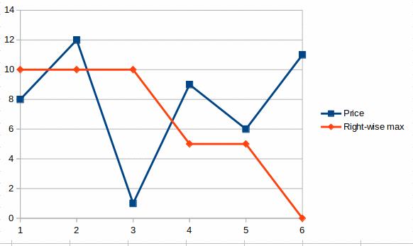

<h2>The efficient solution</h2>
Now that we have the left - right maximum profit curve creation functions ready we can write a function to allow us to solve the problem:

[python]

def get_max_profit(prices):
    m = 0
    index = 0
    left = left_side_max_deltas(prices)
    right = right_side_max_deltas(prices)
    while index < len(prices):
        m = max(m, left[index] + right[index])
        index += 1
    return m

assert get_max_profit([7, 3, 13, 13, 6, 19, 10, 8, 15, 18]) == 26

[/python]

The time complexity of our solution is O(n) and since we are keeping the pre-calculated maximums in memory our memory complexity is also O(n).

Stress testing our new function gives the following results:

[python]
for n in [10, 20, 100, 150, 200, 1000, 10000, 100000]:
    data = creating_dummy_prices(n)
    f = functools.partial(get_max_profit, data)
    print(f'Number of prices: {n}', ' Duration in seconds',
          timeit.timeit(f, number=1))
[/python]

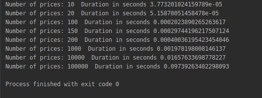

Notice how dramatically faster the new solution is;a price curve of 100,000 data points now takes less than a tenth of a second to be calculated meaning that we have reached an effective and acceptable solution.
<h2>Conclusion</h2>
To solve our problem we initially created a very simple solution which was very slow, thinking a little deeper we were able to improve its performance to be faster and then we discovered a trick that allowed us to come up with an efficient algorithm for our problem; the same process is applicable to most of the problems that require a special algorithm.