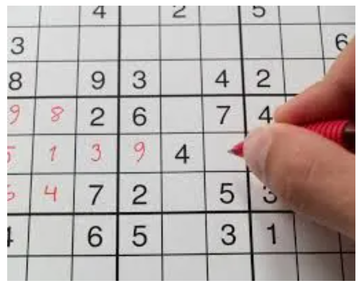

# Sudoku Solver in Python

May 11, 2013

A great way to learn a new language is to simulate a game using it.
Implementing a solution for something that seems so simple as a black jack game
or texas holdem usually presents enough of a challenge to at least get the
feeling of the language.

Sudoku seemed like interesting puzzle to me when stacked in a NYC subway wagon
I was watching the guy next to me scribbling numbers on his paper trying to
solve it. It got my attention, but I admit that after solving a couple of them
later that night, I quickly lost my interest to it. I guess us developers we
are more interested in general solutions as opposed to repeating the same
thinking process over and over solving the same problem with different
parameters.

So, it was more natural for me to write a simple Sudoku Solver in Python
program something that this wonderful language allowed me to implement a
relatively brutal solution very quickly in a matter of an hour or two! If I
have time I will re-implement it using a more sophisticated algorithm but even
this one seems to be reasonably fast…

If you are interested here you can see the code that you can run in any system
supporting python (for ms-windows systems you might need to commend out the
very first line)…

Please let me know if you find any bug or you have a question about the
algorithm…

```python
'''
You can test the module using the following command:

nosetests -v --with-doctest sudoku_solver.py

>>> s = Sudoku()
>>> test_values = ( (0,2,5), (0,3,3), (1,0,8), (1,7,2), (2,1,7), (2,4,1),
(2,6,5), (3,0,4), (3,5,5), (3,6,3), (4,1,1), (4,4,7), (4,8,6),
(5,2,3), (5,3,2), (5,7,8), (6,1,6), (6,3,5), (6,8,9), (7,2,4),
(7,7,3), (8,5,9), (8,6,7))
>>> for v in test_values: s.set_at(*v)
>>> s.solve()
True
>>> str(s)
'145327698839654127672918543496185372218473956753296481367542819984761235521839764'
'''

class Cell:
    '''
    Represents a single cell of the sudoku matrix
    Holds the selected value for the cell and a list
    with all the possible values it can accept at any time
    based in the groups that it belongs
    '''
    def __init__(self):
        self.selection = None
        self.rewind()

    def rewind(self):
        self.acceptable = [] if self.selection else range(1, 10)


class Sudoku:
    '''
    Represents the sudoko grid, mainting a list of all the cells
    allowing the user to set and get their values and to
    solve it by calling the corresponding function.
    '''

    # groups :
    #
    # All the possible groups of values that need
    # to contain the values from 1 to 9 are defined
    # in the class level variable groups. Note that based
    # in how the game is played, we are going to have exactly
    # 27 groups:
    #
    # 9 groups for each horizontal line
    #
    # 9 groups for each vertical line
    #
    # 9 groups for each 3X3 box

    groups = [
        [0, 1, 2, 3, 4, 5, 6, 7, 8],
        [9, 10, 11, 12, 13, 14, 15, 16, 17],
        [18, 19, 20, 21, 22, 23, 24, 25, 26],
        [27, 28, 29, 30, 31, 32, 33, 34, 35],
        [36, 37, 38, 39, 40, 41, 42, 43, 44],
        [45, 46, 47, 48, 49, 50, 51, 52, 53],
        [54, 55, 56, 57, 58, 59, 60, 61, 62],
        [63, 64, 65, 66, 67, 68, 69, 70, 71],
        [72, 73, 74, 75, 76, 77, 78, 79, 80],
        [0, 9, 18, 27, 36, 45, 54, 63, 72],
        [1, 10, 19, 28, 37, 46, 55, 64, 73],
        [2, 11, 20, 29, 38, 47, 56, 65, 74],
        [3, 12, 21, 30, 39, 48, 57, 66, 75],
        [4, 13, 22, 31, 40, 49, 58, 67, 76],
        [5, 14, 23, 32, 41, 50, 59, 68, 77],
        [6, 15, 24, 33, 42, 51, 60, 69, 78],
        [7, 16, 25, 34, 43, 52, 61, 70, 79],
        [8, 17, 26, 35, 44, 53, 62, 71, 80],
        [0, 1, 2, 9, 10, 11, 18, 19, 20],
        [3, 4, 5, 12, 13, 14, 21, 22, 23],
        [6, 7, 8, 15, 16, 17, 24, 25, 26],
        [27, 28, 29, 36, 37, 38, 45, 46, 47],
        [30, 31, 32, 39, 40, 41, 48, 49, 50],
        [33, 34, 35, 42, 43, 44, 51, 52, 53],
        [54, 55, 56, 63, 64, 65, 72, 73, 74],
        [57, 58, 59, 66, 67, 68, 75, 76, 77],
        [60, 61, 62, 69, 70, 71, 78, 79, 80]
    ]

    ROWS, COLS = 9, 9


    def __init__(self):
        ''' Initialized the list of available cells '''
        self.cells = [Cell() for i in range(self.ROWS * self.COLS)]


    def process_group(self, group):
        '''
        For the passed in group it goes through all the cells
        removing the acceptable values for it
        '''
        group_cells = [self.cells[i] for i in group]
        selected_numbers = [cell.selection for cell in group_cells if cell.selection]
        for cell in [c for c in group_cells if c.selection is None]:
            for n in selected_numbers:
                if n in cell.acceptable:
                cell.acceptable.remove(n)


    def row_col_to_flat_index(self, row, col):
        '''Converts a row - col to its corresponding flat list index '''
        return (row % Sudoku.ROWS) * Sudoku.ROWS + col


    def set_at(self, row, col, n):
        '''Sets the value of the cell at row - col to n'''

        cell = self.cells[self.row_col_to_flat_index(row, col)]
        cell.selection = n


    def get_at(self, row, col):
        '''Gets the value of the cell at row - col'''
        cell = self.cells[self.row_col_to_flat_index(row, col)]
        return cell.selection


    def prepare_cells(self):
        '''
        Goes through all the cells assigning the accepted values
        the trick is that if a cell is already assigned with a value
        it is assigned to no accepted values at all.
        You have to understand that this method will be called in a
        recourive manner until a solution is found
        '''
        map(lambda cell: cell.rewind(), self.cells)
        map(self.process_group, Sudoku.groups)


    def found_solution(self):
        '''Returns true if the sudoku was solved'''
        return len([cell for cell in self.cells if cell.selection is None]) == 0


    def solve(self):
        ''' Will try to solve the sudoku return true or false'''
        if self.found_solution():
            return True

        self.prepare_cells()

        if len([c for c in self.cells if
                not c.selection and len(c.acceptable) == 0]) > 0:
            return False

        unassigned = [c for c in self.cells if not c.selection]
        cell_with_min_choices = sorted(unassigned, key=lambda v: len(v.acceptable))[0]

        for n in cell_with_min_choices.acceptable:
            cell_with_min_choices.selection = n
        if self.solve():
            return True

        cell_with_min_choices.selection = None
        return False


    def print_it(self):
        '''Nice printout to the console'''
        for row in range(Sudoku.ROWS):
            for col in range(Sudoku.COLS):
                print
            self.get_at(row, col), ' ',
        print


    def __str__(self):
        s = []
        for row in range(Sudoku.ROWS):
            for col in range(Sudoku.COLS):
                s.append(str(self.get_at(row, col)))
        return ''.join(s)

```