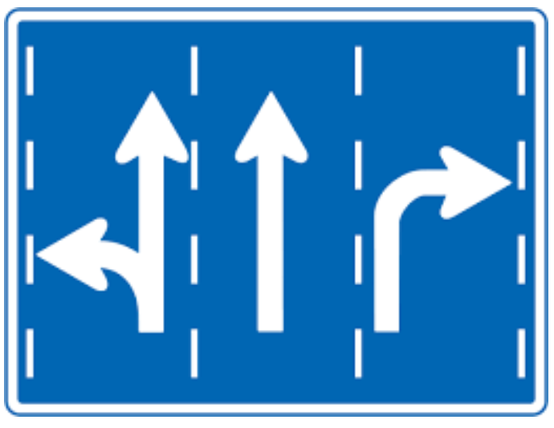

# Technological Directions

March 11, 2013

Starting a new project involves several decisions, the most important of which
is the selection of the technologies to be used.

The technologies used can be scaled from very generic as the operating system,
programming platform and data base to more specific, such as the specific
widget toolkit or the data access mechanism.

Project managers and architects can be divided in the following groups based on
how the adopt to new technologies.

The two extremes can be classified as the technology enthusiast who is
constantly looking for anything new that is still under development and is
ready to start experimenting with alpha and beta releases.

The diametrically opposite of this type is the over conservative technology
phobic who is still using tools like MS-DOS, Turbo Pascal and clipper that have
been abandoned by their parent companies for decades …. Why not, they still do
the job….

Between these two types there is a full spectrum of characters, who are
struggling to take a balanced directional decision. Most of the times, however,
the criteria used are very subjective and usually dominated by tactical (as
opposed to strategic) intentions leading to poor systems with relative short
live duration.

Reaching the right directional decisions requires an extremelly wide exposure
to the available technologies, lots of experience, natural programming talent
and, last but not least, the correct mindset regarding aggression and
conservatism, which are mixed parts of the final tell.
