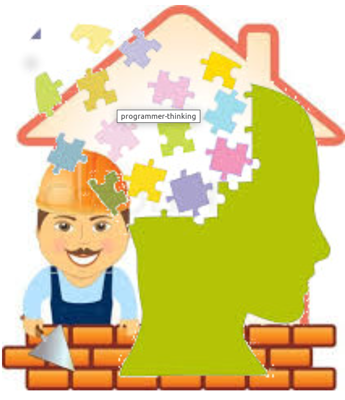

# A wrong metaphor about software development

May 28, 2014


```
Although there are some commonalities, software development differs from home
building to the extend of considering the metaphor to be completely wrong!
```

A very common metaphor used when we talk about software development is to
compare it with home building.

Terms like scaffolding, foundation, architecture any many similar, have become
essential part of the software developer’s jargon.  The roles of an architect,
a civil engineer or a handyman are not so well defined and distinguished when
we are talking about the construction of computerized platforms; indeed these
different types of expertises have a lot of overlap and there are many cases
where it is virtually impossible to clearly separate them.

A brick builder can never ask a question about why he has to build a specific
wall, the kind of a question only refers to the architect  who will be
responsible of the functionality of the building.  Also, the architect, does
not need to know anything about the craft of brick building in the same way
that the electrician does not need to know anything about the plumber’s work.

Developing software involves a lot of judgement calls, research and learning of
new skills to the point of marginalizing the actual ‘building’ phase to just an
implementation detail.

## Its is not purely engineering 

The most important part of any software project
consists of all the judgement calls made by the developer during the various
phases of the implementation.

Given the number of possible approaches that can be followed, the  available
technologies and even the choice of programming language, it is impossible for
any two developers to come up with the same solution even if they are working
out of exactly the same requirements and have comparable expertise and
knowledge.  In contrary, two civil engineers would end up with very close
solutions of the structural dynamics for a specific building since their work
is going to rely on specific mathematical calculations and well defined
regulations and operations.

Although programmers like to refer to what they are doing as Software
Engineering, the true is that although it involves aspects of it, software
development remains a mixture of science, engineering and art.

Talent and experience are probably the most influential characteristics of an
above the average developer and most likely this will not change any time soon.

## Ability to learn is of paramount importance 

```
The most important skill of a successful developer, is how well he knows how to
learn!
```

In comparison to a brick builder or even a civil engineer, the programmer has a
much higher probability  of having the need to learn new concepts and
technologies and even change his approach altogether while he is implementing a
solution.

The learning curve covers both the business domain and the new technologies
that are becoming available as specific areas of computing are becoming more
mature.

Knowing how to learn, is a meta-skill, having to do with the ability to quickly
getting familiar with new concepts, maintaining the proper level of
abstraction.  There are cases where deeper knowledge might be justified as
there are other cases where a higher level understanding is sufficient and the
developer has to master his judgement to intuitively decide to what extend he
needs to learn something new to serve his purposes.

## “Whys” matter as much as “hows” and “what” 

The concept of a software factory has gained ground during the last years. As
the industry matures, software development tends to be treated like an
engineering task that can fit well in a chain of production, having
responsibilities  broken down to a very granular level.

```
Viewing software development as pure engineering leads to the alienation of the
programmer from his users!
```

There is no doubt that operating under a large scale platform we have so many
sub domains that it is impossible for anyone to have a complete view of all the
components and how they are working together.   This does not mean that a
developer should view his work isolated from the whole ecosystem; he should at
least be in contact with the immediate users of his code, regardless if they
are end users interacting with the system through some graphical interface or
some other developers building on top of his code.

A good software developer, should be able to foresee the future needs of his
users trying to provide them with tools that will be easy to evolve and generic
enough to fulfil needs that are completely untaught during the implementation
phase.

An in depth understanding of the whys,  should allow the developer to decide
the ultimate relation of cost and quality, leading to a deliverable optimizing
the two attributes.

## Conclusion 

The software developer should realize that he is involved in a
eternal learning cycle, where one of his most valuable skills is the ability to
learn.  Equipped with this skill, he should never be reluctant to try and
possibly adopt an new concept or technology, realizing that the only way to
remain competitive is to always keep up with the evolution of the industry.

The commonly used analogy of software development to home building, is not very
successful, as there appear to be significant differences between these
activities.  Although home building can easily be separated to specific
specialities the same is not necessary truth for software, where the same
person needs to serve several different roles during the development phase.

The developer needs to be in close contact with his users, learning the
business domain and how his code is been used, so he can have a tell in the
reasoning of design directions getting involved to questions about the why
something needs to be done and not been limited to the what and how.
